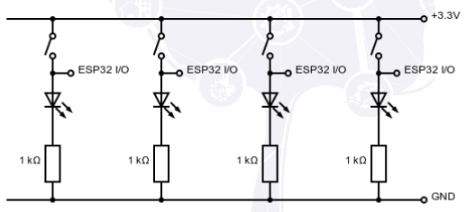
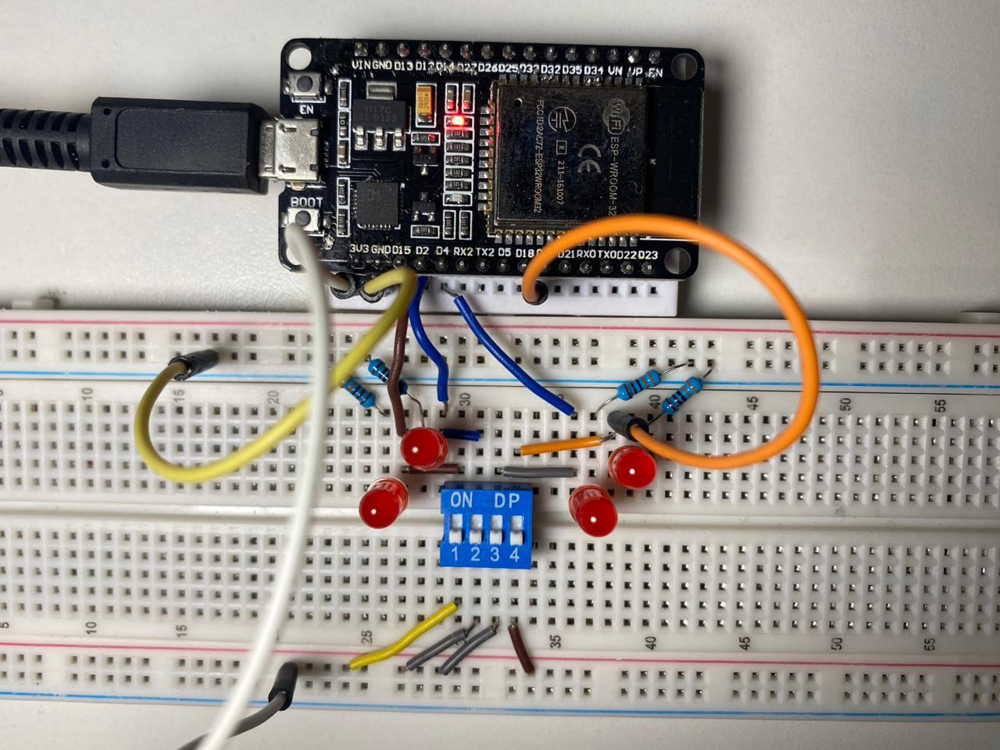

# Estacionamento Inteligente

Estacionamento Inteligente com Integração Interscity

## Sobre o Projeto

Este trabalho propõe o desenvolvimento de um sistema de estacionamento inteligente para enfrentar o crescente desafio da gestão de vagas em áreas urbanas. A solução visa otimizar a utilização de espaços disponíveis, reduzir o tempo de busca por vagas e diminuir o tráfego e emissões de poluentes. A abordagem inclui o uso de microcontroladores de baixo custo e protocolos de comunicação leves, integrados a uma arquitetura de microsserviços, o que garante eficiência, flexibilidade e escalabilidade em cidades inteligentes e sustentáveis.

## Objetivos

- Reduzir o tempo gasto na busca por vagas de estacionamento;
- Contribuir para a redução do trânsito e da poluição do ar nas cidades;
- Coletar dados valiosos para análise de tendências de uso do estacionamento;
- Demonstrar como a integração de tecnologias como IoT pode ser aplicada de forma prática e benéfica para resolver desafios urbanos.

## Recursos do Projeto

- Microcontrolador ESP32;
- APIs da Plataforma InterSCity que receberão os dados simulados do ESP32;
- Plataforma InterSCity para armazenamento, análise e visualização das informações simuladas de ocupação das vagas;
- Protoboards, DIP switchs, LEDS, jumpers e resistores.

## Documentação

- [InterSCity](https://interscity.org/software/interscity-platform/)
- [API InterSCity](https://gitlab.com/interscity/interscity-platform/resource-adaptor/-/wikis/home)

- [DataSheet: ESP32](https://pdf1.alldatasheet.com/datasheet-pdf/view/1243003/ESPRESSIF/ESP32.html)
- [AllDataSheet](https://www.alldatasheet.com/)

## Diagrama elétrico:

## Montagem do protótipo:

